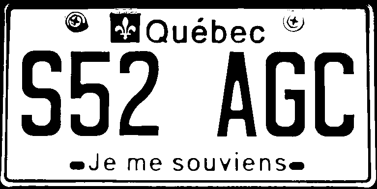
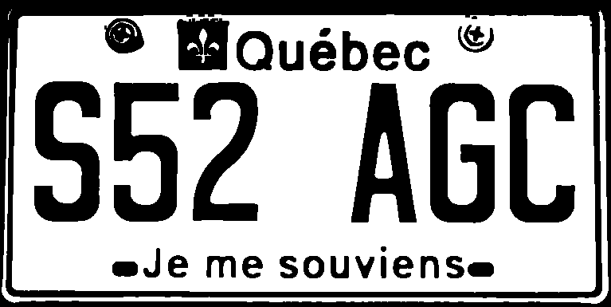
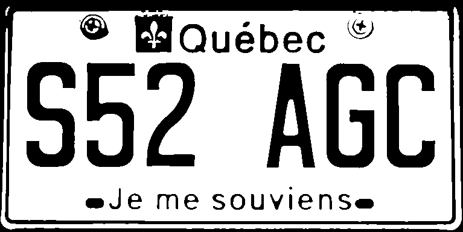

# ELP (Extract Licence Plate)
A tool to extract a licence plate number from an image.

(DONE) Read a .ppm image file, convert image to a table of pixels in
which we can do image manipulation and processing.

(DONE) Write Grayscale conversion function.

(DONE) Write gaussian 3x3 blurring.

(DONE) Write Sobel operator.

(DONE) Write simple binary threshold.

(DONE) Write simple morphological dilation.

(DONE) Write simple morphological erosion.

(DONE) Isolate plate number

Next steps :

- Code needs to be refactored a bit more.

- At this point, the output image is processed well enough to be reliably used
in a OCR library (like tesseract for example) in order to extract the plate
number. For this project, a library will not be used for OCR as this step is
part of the learning process.

- As of now, the program depends heavily on how the isolated plate image
looks, it would make sense to start working on functions that would detect a plate
in a normal image and send the result to the rest of the program.

- Perhaps implement the Canny edge detector to obtain plate contours.

- Lots of optimizations in image processing.

- Keep note that multithreading can be used to optimize image processing.
