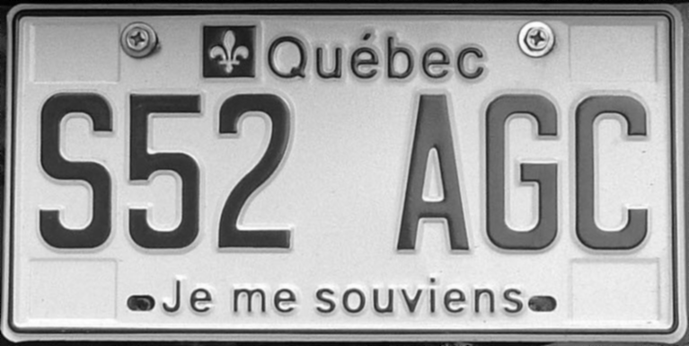

# ELP (Extract Licence Plate)
A tool to extract a licence plate number from an image.

(DONE) Read a .ppm image file, convert image to a table of pixels in
which we can do image manipulation and processing.

(DONE) Write Grayscale conversion function.

(DONE) Write gaussian 3x3 blurring.

