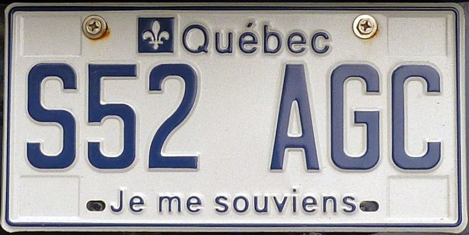
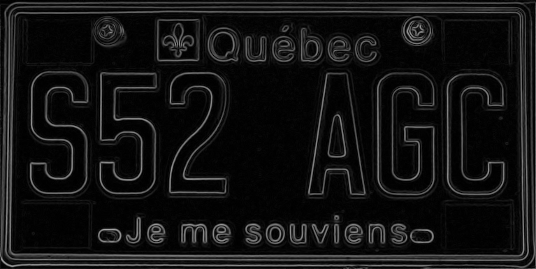

# ELP (Extract Licence Plate)
A tool to extract a licence plate number from an image.

(DONE) Read a .ppm image file, convert image to a table of pixels in
which we can do image manipulation and processing.

(DONE) Write Grayscale conversion function.

(DONE) Write gaussian 3x3 blurring.

(DONE) Write Sobel operator.

(DONE) Write simple binary threshold.

(DONE) Write simple morphological dilation.

(DONE) Write simple morphological erosion.

Next steps :

- Build a function that can create a histogram with respect to x-axis. The
histogram would contain the amount of foreground pixels detected on each
horizontal line.

- Build a function that can determine the minimum amount of pixels to move down
in order to reach the plate number of interest. The function would do the same
thing to find the maximum height (where the plate number ends). These heights
should approximately match specific ratios (0.26 and 0.715) as to minimize the
amount of false positives associated with detecting other non important text.

- Build a function to crop the picture vertically in order to isolate the plate
number.

- Repeat the previous steps to isolate the plate horizontally.
